| Field | Details |
|---|---|
| Project Title | TeamOps - Real-Time Collaborative Project Management Platform |
| Course | Web Technologies |
| Submitted By | Zainab Saeed (CMS ID: 509170), Zunairah Sarwar (CMS ID: 502506) |
| Instructor | Naima Iltaf |
| Project Type | Full-stack web application |
| Frontend | Standalone HTML, CSS, and vanilla JavaScript served through Vite |
| Backend | Node.js, Express 5, Socket.io, MongoDB, Mongoose |
| Core Domain | Team workspaces, Kanban boards, task tracking, real-time collaboration, notifications, role-based access control |
| GitHub Repository | https://github.com/zainabsaeed-cpu/Team-Ops |

## Executive Summary

TeamOps began as a real-time Kanban project management idea for the Web Technologies course and matured into a working full-stack collaboration platform. The proposal established the main academic direction: user accounts, workspaces, Kanban cards, live synchronization, activity logs, notifications, and a practical demonstration of client-server web development. The implemented system keeps that direction but reflects the final repository architecture: a standalone HTML/CSS/JavaScript frontend, an Express 5 backend, Socket.io real-time rooms, and MongoDB/Mongoose persistence.

This report documents the finished project as a submission-ready artifact. It covers the problem being solved, objectives, architecture, database design, backend and frontend implementation, real-time event flow, security controls, testing approach, and future enhancements. The report intentionally notes important changes from the original proposal, especially the shift from React/PostgreSQL planning to the final standalone frontend and MongoDB implementation.

## Abstract

TeamOps is a full-stack collaborative project management system designed to help teams organize work through workspaces, boards, columns, cards, comments, activity logs, notifications, and live updates. The application follows a client-server architecture. The frontend is a standalone HTML/CSS/JavaScript application, while the backend exposes a REST API using Express and persists data in MongoDB through Mongoose models. Real-time synchronization is implemented with Socket.io so that board changes, comments, activity events, notifications, and workspace presence can update connected users without requiring a page refresh.

The main objective of TeamOps is to provide a practical teamwork platform similar to a lightweight Trello/Jira-style board, but with a student-project scope that demonstrates authentication, authorization, database modeling, REST API design, real-time events, and frontend state management. The system supports email registration with OTP verification, Google sign-in, HTTP-only cookie-based JWT sessions, workspace creation, invite codes, email invite tokens, owner/admin/member/viewer roles, manual board creation, card CRUD operations, drag-and-drop movement, activity filtering, analytics, notifications, profile management, and user-specific "My Work" views.

## Problem Statement

Many student teams and small project groups manage tasks through scattered messages, spreadsheets, or informal notes. This creates problems such as unclear ownership, missing deadlines, poor visibility of progress, and delayed communication when one member changes task status. TeamOps solves this by providing a centralized workspace where team members can create boards, assign cards, track progress, comment on tasks, and receive live updates.

The project focuses on these core problems:

- Teams need a shared space to organize project work.
- Members need clear task ownership, priority, and due dates.
- Admins need control over workspace membership and permissions.
- Users should see updates live instead of manually refreshing.
- Activity history should make collaboration traceable.
- Notifications should highlight assignments and mentions.
- The system should be understandable, maintainable, and suitable for future extension.

## Objectives

The objectives of TeamOps are:

1. Build a complete full-stack project management application.
2. Implement secure user authentication using JWT and hashed passwords.
3. Add email verification and password reset through OTP codes.
4. Support Google sign-in as an alternative authentication provider.
5. Model users, workspaces, boards, columns, cards, comments, activities, and notifications in MongoDB.
6. Enforce role-based access control across workspace and board operations.
7. Implement real-time board synchronization with Socket.io rooms.
8. Provide a Kanban-style UI where cards can be created, edited, deleted, assigned, filtered, and moved.
9. Maintain activity logs and audit-style visibility for governance-related actions.
10. Generate useful analytics such as cards per column, completed cards this week, overdue cards, and cards per assignee.
11. Keep the frontend and backend organized as separate maintainable packages.

## Existing Repository Structure

```text
TeamOps/
  teamops-backend/
    server.js
    models/index.js
    controllers/
    routes/
    middleware/
    socket/
    utils/
  teamops-frontend/
    index.html
    styles.css
    vite.config.js
    package.json
```

The active frontend is `teamops-frontend/`. It is intentionally implemented as a standalone HTML/JS app. The main application logic is in `index.html`, and the visual design is in `styles.css`. There is no active React `src/` application.

## Technology Stack

| Layer | Technology | Purpose |
|---|---|---|
| Frontend | HTML5 | App markup and view structure |
| Frontend | CSS3 | Responsive dashboard, modals, board UI, animations |
| Frontend | Vanilla JavaScript | API calls, local state, DOM rendering, drag-and-drop |
| Frontend Server | Vite | Static development server and build output |
| Backend Runtime | Node.js | JavaScript server runtime |
| Backend Framework | Express 5 | REST API routing and middleware |
| Real-Time | Socket.io | WebSocket-style bidirectional events |
| Database | MongoDB | Document database |
| ODM | Mongoose | Schemas, models, queries, validation, indexes |
| Authentication | JWT in HTTP-only cookie | Stateless signed session stored as a secure browser cookie |
| Password Security | bcryptjs | Password hashing and comparison |
| OAuth | Google Auth Library | Google ID token verification |
| Email | Nodemailer/Resend utility layer | Verification, reset, invitation emails |

## System Architecture

TeamOps uses a layered architecture:

```text
Browser
  |
  | REST requests with browser-sent session cookie
  | Socket.io connection authenticated from session cookie
  v
Express API server
  |
  | Controllers enforce validation and business rules
  v
Mongoose models and formatter helpers
  |
  v
MongoDB database

Socket.io rooms:
  board:<boardId>      board updates and activity
  user:<userId>        private notifications
  workspace:<id>       workspace presence count
```

The backend issues the JWT as an HTTP-only `teamops_session` cookie and sends a readable `teamops_csrf` cookie for CSRF protection. For protected API requests, the browser sends the session cookie automatically and the frontend adds an `X-CSRF-Token` header for unsafe state-changing requests. The backend verifies the cookie token in `middleware/auth.js`, stores `req.userId`, and then controllers use that user id to check workspace membership and role permissions. Socket.io also authenticates from the session cookie instead of a manually supplied bearer token.

## Workflow Flow Diagrams

### User Authentication Workflow

```text
[Visitor]
   |
   v
[Register / Login / Google Sign-In]
   |
   +--> Email registration --> [Create unverified user]
   |                            |
   |                            v
   |                         [Send OTP]
   |                            |
   |                            v
   |                         [Verify OTP]
   |
   +--> Email login --------> [Check password hash]
   |
   +--> Google login -------> [Verify Google ID token]
                                |
                                v
                         [Issue JWT session cookie]
                                |
                                v
                         [Set CSRF cookie]
                                |
                                v
                         [Open workspace setup or dashboard]
```

### Workspace and Board Workflow

```text
[Authenticated user]
   |
   v
[Workspace setup]
   |
   +--> Create workspace --> [Owner role assigned]
   |                          |
   |                          v
   |                       [Create board]
   |                          |
   |                          v
   |                       [Default columns created]
   |
   +--> Join by invite code --> [Member role assigned]
   |
   +--> Join by email token --> [Validate token, email, expiry]
                                |
                                v
                         [Dashboard loads selected workspace]
                                |
                                v
                         [Board, members, analytics, activity]
```

### Card Collaboration Workflow

```text
[Member/Admin/Owner]
   |
   v
[Create or edit card]
   |
   +--> Assign user --------> [Create assignee notification]
   |
   +--> Add comment/mention -> [Create mention notification]
   |
   +--> Drag card ----------> [PATCH move endpoint]
                                |
                                v
                         [Validate role and board scope]
                                |
                                v
                         [Recalculate card positions]
                                |
                                v
                         [Save MongoDB changes]
                                |
                                v
                         [Create activity record]
                                |
                                v
                         [Emit Socket.io board event]
                                |
                                v
                         [Connected clients update live]
```

### Admin and Audit Workflow

```text
[Owner/Admin]
   |
   v
[Members / Settings / Audit views]
   |
   +--> Invite member -----> [Generate code or email token]
   |
   +--> Change role -------> [Validate role hierarchy]
   |
   +--> Remove member -----> [Check requester permissions]
   |
   +--> Update settings ---> [Save automation settings]
                                |
                                v
                         [Log governance activity]
                                |
                                v
                         [Emit workspace settings/presence updates]
                                |
                                v
                         [Audit log shows sensitive changes]
```

## Database Design

All active Mongoose models and formatter helpers are in `teamops-backend/models/index.js`.

| Model | Main Fields | Purpose |
|---|---|---|
| User | name, email, passwordHash, avatarUrl, googleId, authProvider, verified, notifyEmail, notifyPush | Stores account and profile data |
| VerificationToken | userId, token, expiresAt | OTP verification and reset code storage |
| WorkspaceInviteToken | token, workspaceId, email, role, expiresAt, used | Secure email invite joining |
| Workspace | name, description, techStack, owner, inviteCode, members | Top-level team container |
| Board | workspaceId, name, color | Project board inside a workspace |
| Column | workspace, board, title, position | Kanban workflow stage |
| Card | column, title, description, priority, assignee, dueDate, position | Task item |
| Comment | board, card, user, taggedCards, taggedMembers, content | Board and card discussions |
| Activity | workspace, board, user, userId, workspaceId, boardId, action | Timeline/audit events |
| Notification | user, message, is_read, is_important | User inbox alerts |

### Relationships

- A user can belong to many workspaces through `Workspace.members`.
- A workspace has many boards.
- A board has many columns.
- A column has many cards.
- A card may have one assignee.
- Comments can belong to either a board or a card.
- Activities belong to workspace and board scope.
- Notifications belong to a specific user.

### ER Diagram

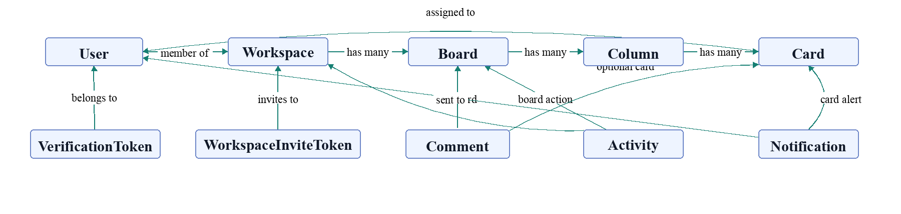

### Why MongoDB Fits This Project

MongoDB is suitable because the app has nested, document-friendly entities such as workspace members and fast-changing collaborative board data. Mongoose schemas still provide structure, indexes, validation, and model-level consistency. The project uses references for relationships that need independent queries, such as cards, columns, comments, users, boards, and activities.

## Backend Design

### Server Setup

The backend entry point is `teamops-backend/server.js`. It:

- Loads environment variables.
- Creates an Express app and HTTP server.
- Attaches Socket.io to the same HTTP server.
- Configures CORS with local development support.
- Adds JSON request parsing.
- Registers REST route modules.
- Exposes a `/api/health` endpoint.
- Connects to MongoDB.
- Seeds sample data if the database is empty and the environment is not production.
- Starts the server.

### REST API Modules

| Route Prefix | Responsibility |
|---|---|
| `/api/auth` | Register, login, verify, resend verification, Google login, forgot/reset password, current user |
| `/api/workspaces` | Workspace CRUD, members, roles, invite code joining, email invite joining, workspace boards |
| `/api/boards` | Board data, analytics, comments, columns, cards, movement |
| `/api/activities` | Activity timeline and audit views |
| `/api/notifications` | Notification inbox, unread count, mark read, mark all read, important flag |
| `/api/user` | Profile, password change, assigned cards |

### Authentication Flow

For email registration:

1. User submits name, email, and password.
2. Backend trims and normalizes data.
3. Password is hashed with bcrypt.
4. User is created as unverified.
5. Six-digit OTP is generated and stored in `VerificationToken`.
6. Verification email is sent.
7. User enters OTP.
8. Backend verifies token and expiry.
9. User becomes verified.
10. JWT is issued in an HTTP-only cookie for a seven-day session.

For login:

1. User submits email and password.
2. Backend finds the normalized email.
3. Backend rejects unknown, unverified, or Google-only accounts where appropriate.
4. bcrypt compares the submitted password with the stored hash.
5. A signed JWT session cookie is set.

For Google login:

1. Frontend receives a Google credential.
2. Backend verifies the ID token using Google Auth Library.
3. Backend extracts Google id, email, name, and avatar.
4. Existing user is updated or a new Google user is created.
5. The same workspace setup flow is used as email signup: if no workspace exists, the user is asked to create or join one.
6. A signed JWT session cookie is set.

### Authorization and RBAC

TeamOps uses workspace roles:

| Role | Level | Typical Permissions |
|---|---:|---|
| owner | 3 | Full workspace control, delete workspace, manage all members |
| admin | 2 | Manage boards, columns, members, settings, invites |
| member | 1 | Create/edit/move cards, comment, collaborate |
| viewer | 0 | Read board data and comments, limited interaction |

The backend uses both route middleware and controller-level checks. The `requireRole` middleware resolves the workspace from route params or related board/column/card ids, then validates that the current user has one of the required roles. Controllers also use helper functions such as `checkWorkspaceAccess` and `resolveBoardAccess` to enforce role hierarchy before sensitive operations.

### Real-Time Design

Socket.io is initialized in `server.js` and handled in `socket/index.js`. During connection, the server parses the session cookie from the socket handshake headers and verifies the JWT. If valid, it joins a private `user:<userId>` room.

The frontend joins board and workspace rooms:

- `board:join` or `join:board` to subscribe to board updates.
- `workspace:join` or `join:workspace` to subscribe to presence count.
- `join:user` for private notification delivery.

Important emitted events include:

| Event | Use |
|---|---|
| `card:created` | A new card was added |
| `card:updated` | Card details changed |
| `card:deleted` | Card removed |
| `card:moved` | Card moved to another column/position |
| `column:created` | Board column added |
| `column:deleted` | Board column removed |
| `card:commented` | Card comment created |
| `comment:deleted` | Card comment deleted |
| `board:commented` | Board comment created |
| `board:comment:deleted` | Board comment deleted |
| `activity:new` | Timeline event created |
| `notification:new` | User notification created |
| `workspace:presence` | Current active connection count for workspace |

## Frontend Design

The frontend is a standalone app inside `teamops-frontend/index.html` and `teamops-frontend/styles.css`. It does not use React components. The app uses DOM functions, `fetch`, local state variables, browser cookies for authentication, limited `localStorage` for non-sensitive UI/workspace context, custom modals, custom select controls, and Socket.io client events.

Main frontend responsibilities:

- Switching views such as landing, auth, workspace setup, join workspace, and dashboard.
- Managing authentication forms and verification/reset flows.
- Keeping only non-sensitive UI context in `localStorage`, such as selected workspace/board ids and saved views.
- Calling REST endpoints through a shared `apiRequest` helper with `credentials: 'include'` and CSRF headers for unsafe requests.
- Connecting to Socket.io and subscribing to board/user/workspace rooms.
- Rendering boards, columns, cards, filters, comments, activity, notifications, members, analytics, profile, and saved views.
- Enforcing role-based UI restrictions so viewers cannot create/edit/delete cards or columns.
- Providing drag-and-drop behavior for card movement.
- Showing toast feedback and confirmation dialogs.
- Supporting dashboard pages for projects, roadmap, integrations, channels, help, saved views, profile, workspace settings, and audit logs.

## Application Screenshots

The following screenshots document the main user-facing output of TeamOps. They show the public entry screen, authentication flow, workspace onboarding, dashboard shell, empty board state, analytics, members page, workspace settings, and card creation workflow.

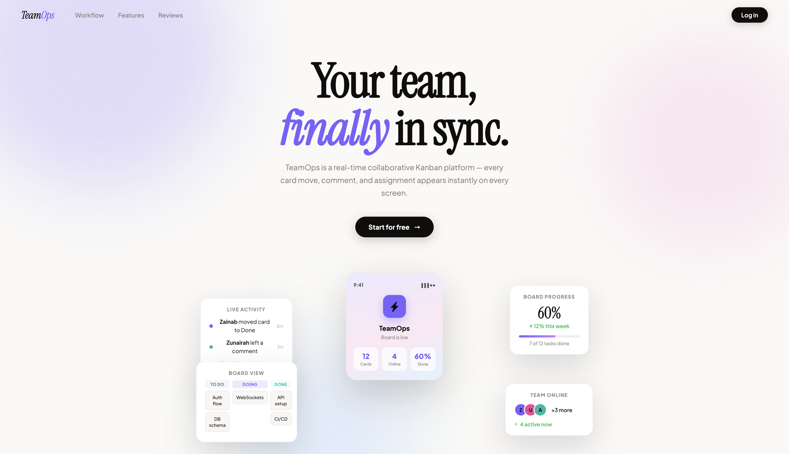

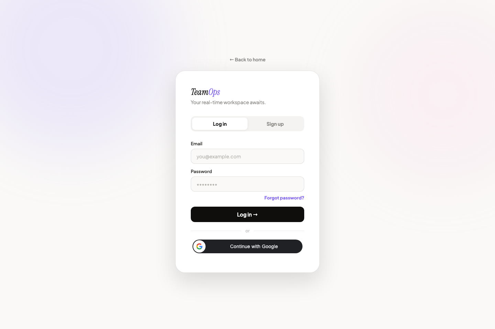

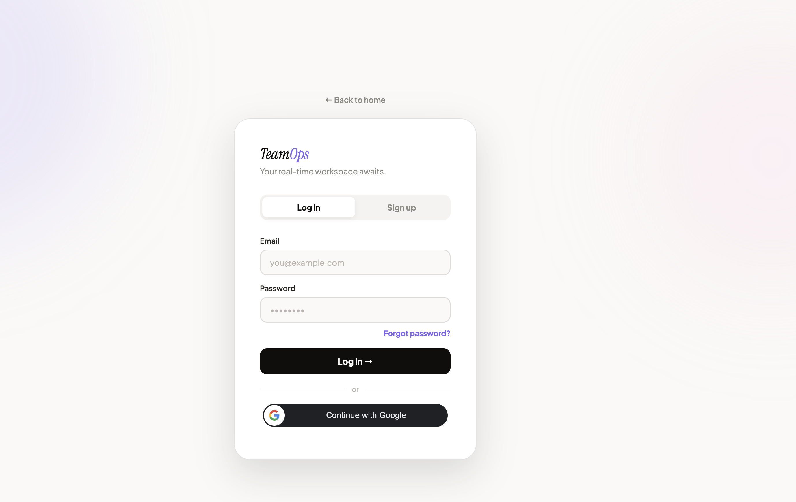

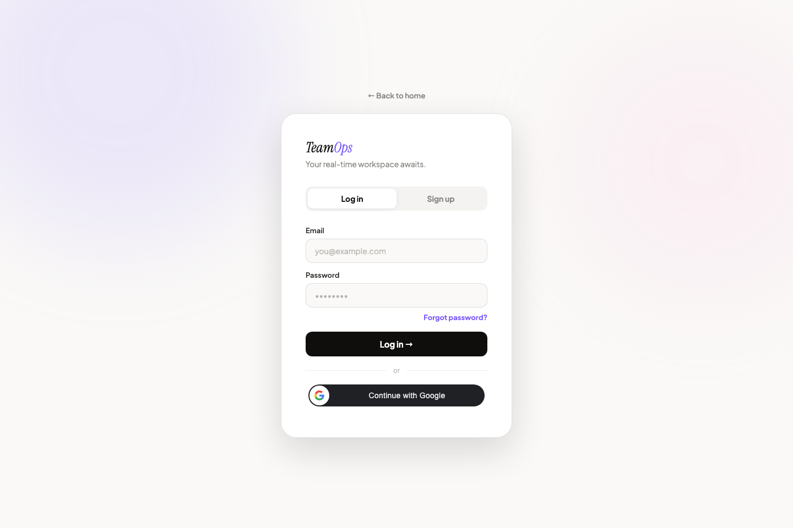

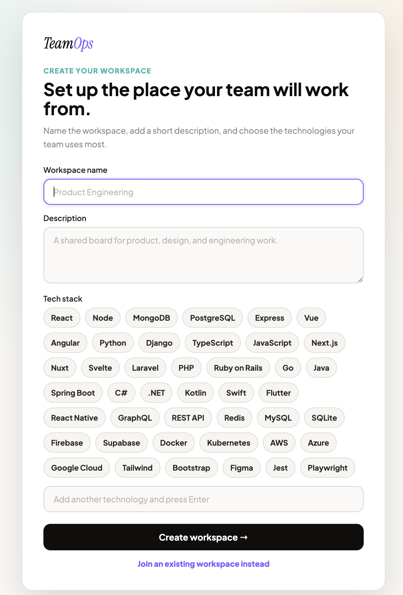

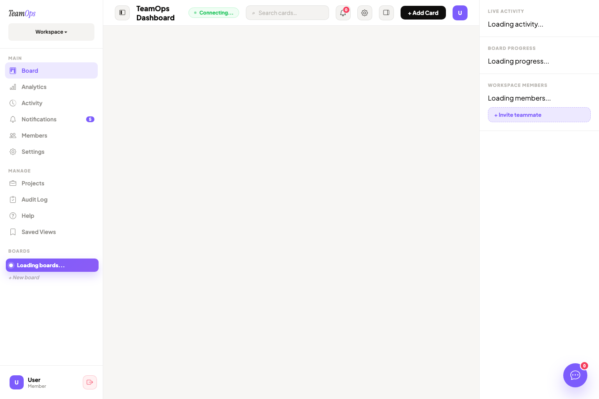

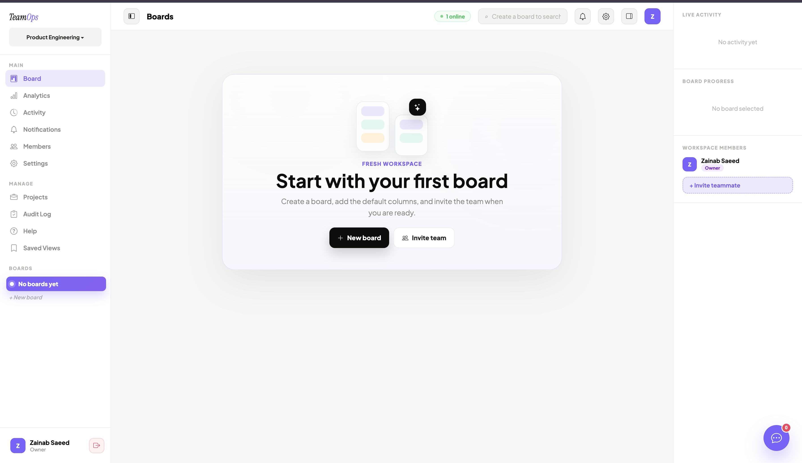

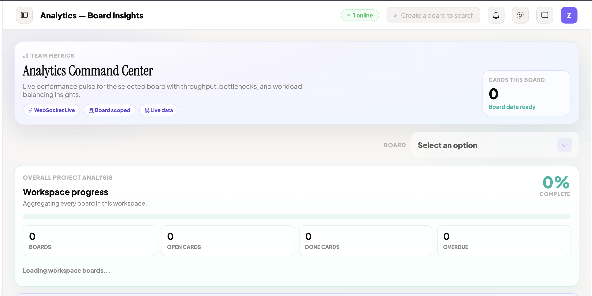

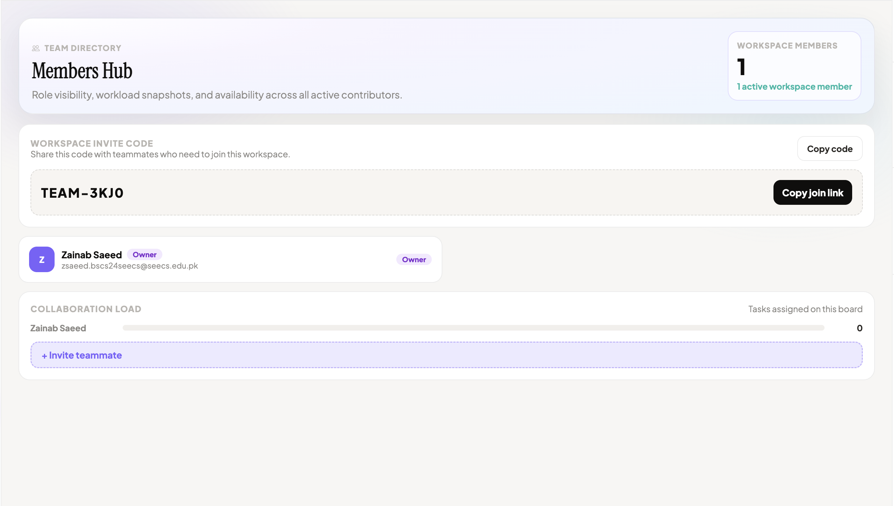

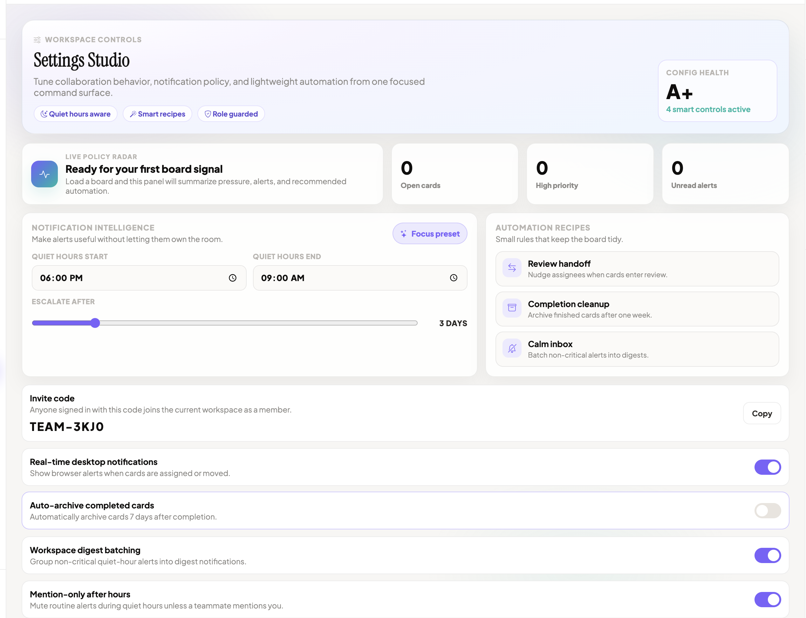

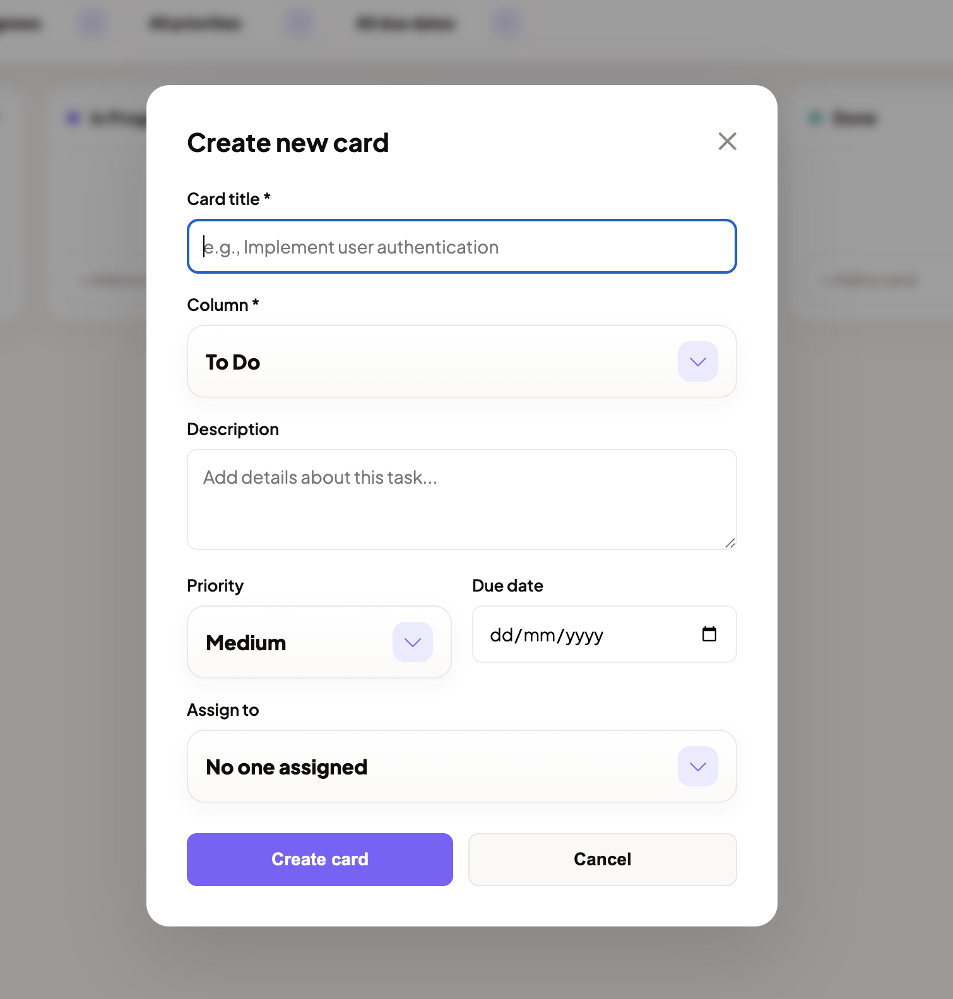

## Core Functional Modules

### Workspaces

Users can create workspaces with a name, description, and tech stack. Each workspace has an owner and an invite code. Workspaces contain members with roles. Owners/admins can invite users, update roles, and remove eligible members. The system also supports joining through an invite code and joining through a secure email invite token.

### Boards and Columns

Each workspace can contain boards, but a newly created workspace starts empty so the user can decide whether to create a board or join an existing workspace. Owners and admins can create, update, and delete boards and columns. When a board is created, the backend adds the default workflow columns: `To Do`, `In Progress`, `In Review`, and `Done`.

### Cards

Cards represent tasks. A card stores:

- title
- description
- priority
- assignee
- due date
- column id
- position

Members and above can create, update, delete, and move cards. The backend validates that a card belongs to the correct board before allowing updates. When a card is assigned to another user, the system creates a notification for that user.

### Drag-and-Drop Movement

The frontend uses HTML drag-and-drop events. When a card is dropped into another column, the frontend calls:

```text
PATCH /api/boards/:boardId/cards/:cardId/move
```

The backend validates access, verifies source and destination columns, recalculates positions, saves the card, creates an activity entry, notifies the assignee if required, and emits `card:moved` to the board room.

### Comments and Mentions

TeamOps supports:

- Card comments.
- Board comments.
- Board comment tagged cards.
- Board comment tagged members.

Tagged members receive important notifications. The backend normalizes tagged ids to ensure that only cards from the current board and members from the current workspace can be referenced.

### Activity and Audit

Every important action can create an activity record. The project separates normal collaboration activity from governance-sensitive activity. Governance-related events include workspace, invite, member, role, permission, login, password, profile, account, security, and deletion events. Owners and admins can view broader audit logs, while members/viewers see limited events.

### Notifications

Notifications are created for assignments, mentions, moved assigned cards, and other important events. The inbox supports:

- unread count
- mark one notification as read
- mark all as read
- important flag toggle
- real-time `notification:new` delivery

### Analytics

The board analytics endpoint calculates:

- cards per column
- completed cards this week
- cards per assignee
- overdue card count

This gives the dashboard measurable project status without requiring a separate analytics database.

### Dashboard and Saved Views

The dashboard has grown into a complete workspace command center. In addition to the live board, it includes pages for projects, roadmap, integrations, communication channels, help, saved views, members, settings, profile, notifications, activity, analytics, and audit logs. Saved views allow a user to preserve useful board filters locally so repeated workflows can be reopened quickly.

### Workspace Settings and Automation

Owners and admins can adjust workspace automation settings such as desktop notification preferences, review nudges, escalation days, weekly digest behavior, after-hours mention filtering, and completed-card cleanup. The backend normalizes these settings, persists them on the workspace, runs supported automation actions, and emits `workspace:settings` so connected clients can refresh the visible settings state.

### Profile and My Work

Users can view and update profile details, upload an avatar, change password, and see cards assigned to them across accessible boards. This makes the app useful from both manager and individual contributor perspectives.

## Key Algorithms and Logic

### Cookie-Based JWT Authentication

The backend signs tokens using:

```text
payload: { userId }
expiry: 7 days
secret: JWT_SECRET
```

The JWT is stored in the `teamops_session` HTTP-only cookie. Every protected route requires that cookie. The middleware verifies the token and sets `req.userId`. For unsafe methods such as POST, PATCH, and DELETE, authenticated requests also include the `X-CSRF-Token` header matching the readable `teamops_csrf` cookie.

### Role Resolution

For a request involving a board, column, or card, the backend resolves the workspace id. Then it checks whether the current user is present in `workspace.members` and has the required role.

### Card Positioning

When a card moves:

1. Load the card.
2. Load source column and target column.
3. Verify both columns belong to the current board.
4. Remove the moved card from the destination list if it is already there.
5. Insert the card at the target index.
6. Save the destination cards with updated positions.
7. Recalculate source column positions if the card changed columns.
8. Emit a real-time event and return success.

### Due Date Rule

The backend prevents active cards from being assigned a due date in the past. A past due date is allowed if the card is already in a `Done` column, or when preserving an existing historical date. This avoids accidental invalid scheduling while still allowing completed historical work.

### Activity Visibility

Activity filtering uses a governance pattern. Owners/admins can see governance events. Members/viewers only see governance events they personally caused, while normal board collaboration remains visible.

## Security Considerations

| Area | Current Implementation |
|---|---|
| Password storage | bcrypt hashing, no plain password storage |
| Session auth | JWT stored in HTTP-only cookie with server-side verification |
| CSRF protection | Double-submit CSRF cookie/header for unsafe authenticated requests |
| Email verification | OTP stored with expiry |
| Password reset | OTP reset code with expiry |
| Google login | Google ID token verification |
| Authorization | Workspace role checks in middleware and controllers |
| Input validation | Required fields, trimmed values, role validation, date validation |
| CORS | Configurable origin allowlist with local dev support |
| Data scoping | Board/column/card operations verify workspace membership |
| Realtime privacy | Socket.io reads the session cookie and user notifications emit to `user:<userId>` room |

Potential improvements:

- Enforce a stronger `JWT_SECRET` in all environments.
- Add rate limiting for login, verification, and reset endpoints.
- Hash OTP/reset tokens before storing them.
- Add server-side file storage instead of base64 avatars.
- Add account lockout controls for repeated failed auth attempts.
- Add schema-level indexes for common analytics and activity queries.
- Add automated tests for auth, RBAC, board movement, and invite flows.
- Use Redis adapter if Socket.io needs multiple backend instances.

## Testing and Verification

The repository does not include a formal automated test suite, but it includes useful verification commands:

Backend:

```bash
cd teamops-backend
npm test
```

The backend `test` script currently runs `node --check server.js`, which verifies JavaScript syntax for the entry file.

Frontend:

```bash
cd teamops-frontend
npm run lint
npm run build
```

The frontend `test` script runs lint and build. Because the active app is standalone HTML/JS, manual testing is still important.

## Future Enhancements

1. Add automated backend tests with Jest or Node's built-in test runner.
2. Add Playwright end-to-end tests for authentication, board CRUD, movement, and invites.
3. Add file attachments to cards using cloud storage.
4. Add recurring tasks and task templates.
5. Add Redis adapter for multi-instance Socket.io scaling.
6. Add rate limiting and audit hardening for auth routes.
7. Add advanced reports such as burndown charts and cycle time.
8. Add email notification preferences connected to backend settings.
9. Add mobile-friendly refinements and PWA support.
10. Split frontend logic into smaller modules while keeping the no-React architecture if required.

## Conclusion

TeamOps successfully demonstrates a full-stack real-time collaboration platform. It combines authentication, authorization, database design, REST APIs, WebSocket events, frontend state rendering, Kanban workflows, notifications, activity logging, and analytics in one coherent project. The most important technical achievement is that the app is not just a static dashboard: actions on boards are persisted in MongoDB, scoped by workspace permissions, logged as activities, and broadcast to connected users through Socket.io.

The project is suitable for a project submission because it covers core software engineering topics: requirements analysis, system architecture, schema design, API design, security, real-time communication, UI implementation, testing strategy, and future work.

## Appendix A: Important API Endpoints

| Method | Endpoint | Purpose |
|---|---|---|
| POST | `/api/auth/register` | Register new user |
| POST | `/api/auth/verify` | Verify email OTP |
| POST | `/api/auth/login` | Login with email/password |
| POST | `/api/auth/google` | Login using Google credential |
| POST | `/api/auth/forgot-password` | Start reset flow |
| POST | `/api/auth/reset-password` | Reset password using OTP |
| POST | `/api/auth/logout` | Clear session and CSRF cookies |
| GET | `/api/workspaces` | List user's workspaces |
| POST | `/api/workspaces` | Create workspace |
| POST | `/api/workspaces/join` | Join workspace using invite code |
| GET | `/api/workspaces/join/invite` | Accept secure email invite token |
| GET | `/api/workspaces/:workspaceId/boards` | List boards in workspace |
| POST | `/api/workspaces/:workspaceId/boards` | Create board |
| POST | `/api/workspaces/:workspaceId/invite-email` | Send workspace email invite |
| GET | `/api/workspaces/:workspaceId/automation-settings` | Load workspace automation settings |
| PATCH | `/api/workspaces/:workspaceId/automation-settings` | Update workspace automation settings |
| GET | `/api/boards/:boardId` | Get board with columns/cards |
| GET | `/api/boards/:boardId/analytics` | Get board analytics |
| POST | `/api/boards/:boardId/cards` | Create card |
| PATCH | `/api/boards/:boardId/cards/:cardId` | Update card |
| PATCH | `/api/boards/:boardId/cards/:cardId/move` | Move card |
| DELETE | `/api/boards/:boardId/cards/:cardId` | Delete card |
| GET | `/api/activities/workspace/:workspaceId/audit` | Get admin audit log |
| GET | `/api/notifications` | Notification inbox |
| GET | `/api/user/profile` | User profile |
| PATCH | `/api/user/profile` | Update profile |
